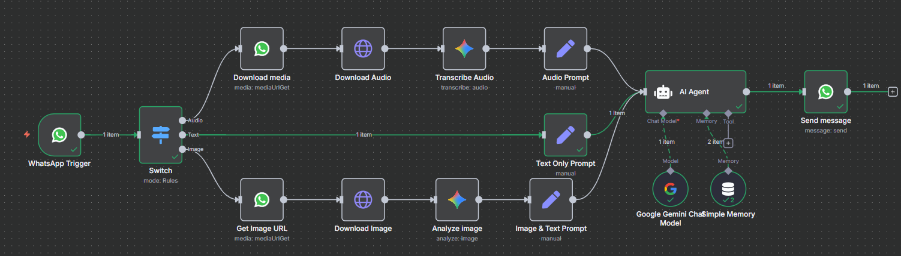

# WhatsApp AI Agent with Multi-Modal Support

[](LICENSE)
[](https://docs.n8n.io/)
[](https://developers.facebook.com/docs/whatsapp)
[](https://ai.google.dev/)
[](CONTRIBUTING.md)
[](https://github.com/ZohaibCodez/n8n-whatsapp-ai-agent/issues)
[](https://github.com/ZohaibCodez/n8n-whatsapp-ai-agent)

A sophisticated n8n workflow that creates an intelligent WhatsApp bot capable of processing text messages, voice notes, and images using Google Gemini AI.

## 📸 Demo Screenshots
For live demo screenshots showcasing the AI agent in action, including WhatsApp conversations, voice transcription, image analysis, and workflow overview, please check the docs/demo-screenshots/ folder in this repository.

### Architecture Diagram

*High-level architecture showing message flow and processing*

## 🌟 Features

- **Multi-Modal Processing**: Handles text, audio, and image inputs seamlessly
- **Voice Transcription**: Converts WhatsApp voice messages to text using Google Gemini
- **Image Analysis**: Analyzes and describes images sent via WhatsApp
- **Conversation Memory**: Maintains context across conversations using session-based memory
- **Smart Routing**: Automatically detects message type and routes to appropriate processing pipeline
- **Real-time Responses**: Instant AI-powered replies through WhatsApp Business API

## 🏗️ Architecture

The workflow uses a smart routing system that:
1. **Receives** WhatsApp messages via webhook trigger
2. **Analyzes** message type (text, audio, or image)
3. **Routes** to appropriate processing pipeline:
   - **Text**: Direct AI processing
   - **Audio**: Download → Transcribe → AI processing
   - **Image**: Download → Analyze → AI processing with context
4. **Responds** through WhatsApp Business API with contextual memory

## 📋 Prerequisites

Before getting started, you'll need:

- **n8n instance** (self-hosted or cloud)
- **WhatsApp Business API** account
- **Google Gemini API** key
- **Meta Developer** account for WhatsApp integration

### Required APIs & Services

| Service | Purpose | Documentation |
|---------|---------|---------------|
| WhatsApp Business API | Message handling | [Meta for Developers](https://developers.facebook.com/docs/whatsapp) |
| Google Gemini API | AI processing & transcription | [Google AI Studio](https://makersuite.google.com/app/apikey) |
| n8n | Workflow automation | [n8n Documentation](https://docs.n8n.io/) |

## 🚀 Quick Start Guide

### Step 1: Clone the Repository
```bash
git clone https://github.com/ZohaibCodez/n8n-whatsapp-ai-agent.git
cd n8n-whatsapp-ai-agent
```

### Step 2: Import Workflow
1. Open your n8n instance
2. Go to **Workflows** → **Import from File**
3. Select `workflows/whatsapp-agent.json`
4. **Important**: Ensure the workflow imports as inactive. Activate only after configuring credentials.

### Step 3: Configure Credentials
Set up the following credentials in n8n:

#### WhatsApp Business API
- **Phone Number ID**: Your WhatsApp Business phone number ID
- **Access Token**: WhatsApp Business API access token
- **Webhook Verification Token**: For webhook security

#### Google Gemini API
- **API Key**: Your Google AI Studio API key

> **Security Note**: The shared workflow JSON contains no credentials or live webhook IDs. You must add credentials in n8n and replace placeholder values (e.g., `YOUR_PHONE_NUMBER_ID`).

### Step 4: Configure Webhook
1. Set up your n8n webhook URL in Meta Developer Console
2. Configure webhook events: `messages`
3. Update webhook verification token

### Step 5: Test the Agent
Send a message to your WhatsApp Business number to test the integration!

## 💬 Usage Examples

### Text Conversations
```
User: "What's the weather like today?"
Zorox: "I'd be happy to help! However, I don't have access to real-time weather data..."
```

### Voice Messages
- Send a voice note → Automatically transcribed and processed
- Response considers the transcribed content

### Image Analysis
- Send an image → Automatically analyzed and described
- Include caption for specific questions about the image

## ⚙️ Configuration

### System Prompt
The AI agent uses a customizable system prompt that includes:
- Bot personality (Zorox - helpful assistant)
- User identification via WhatsApp ID
- Current timestamp for context

### Memory Settings
- **Session Key**: Uses WhatsApp ID for user-specific memory
- **Context Window**: 20 messages retained
- **Memory Type**: Buffer window for conversation continuity

## 🛠️ Technical Details

### Workflow Nodes Breakdown

| Node | Function | Notes |
|------|----------|-------|
| WhatsApp Trigger | Receives messages | Webhook-based |
| Switch | Routes by message type | Text/Audio/Image |
| AI Agent | Core AI processing | Google Gemini powered |
| Simple Memory | Conversation context | Session-based |
| Download Media | Fetches audio/images | WhatsApp Media API |
| Transcribe Audio | Speech-to-text | Gemini 1.5 Flash |
| Analyze Image | Image description | Gemini Vision |

## 🎛️ Customization

### Modify AI Behavior
Edit the system prompt in the "AI Agent" node to change personality or capabilities.

### Add New Media Types
Extend the Switch node to handle additional WhatsApp media types like documents or videos.

### Enhance Image Processing
Modify the "Analyze Image" node prompt for specific use cases (OCR, object detection, etc.).

## 🔒 Security Considerations

- **Webhook Security**: Always use verification tokens
- **API Keys**: Store securely in n8n credentials
- **Rate Limiting**: Monitor usage to avoid API limits
- **Data Privacy**: Consider GDPR/privacy regulations for message storage
- **Safe Exports**: If you re-share, remove any IDs and keep `active: false`. See `SECURITY.md`.

## 🐛 Troubleshooting

### Common Issues

**Webhook not receiving messages:**
- Verify webhook URL is accessible
- Check verification token matches
- Ensure WhatsApp webhook is active

**Media download failing:**
- Confirm media URLs are valid
- Check authentication headers
- Verify media size limits

**AI responses timing out:**
- Monitor Gemini API quotas
- Check network connectivity
- Consider reducing context window

## 🤝 Contributing

We welcome contributions! Here's how to get started:

1. Fork the repository
2. Create a feature branch: `git checkout -b feature/amazing-feature`
3. Commit your changes: `git commit -m 'Add amazing feature'`
4. Push to the branch: `git push origin feature/amazing-feature`
5. Open a Pull Request

## 📬 Support & Community

- **Issues**: [GitHub Issues](https://github.com/ZohaibCodez/n8n-whatsapp-ai-agent/issues)
- **Discussions**: [GitHub Discussions](https://github.com/ZohaibCodez/n8n-whatsapp-ai-agent/discussions)
- **n8n Community**: [n8n Community Forum](https://community.n8n.io/)

## 📝 License

This project is licensed under the MIT License - see the [LICENSE](LICENSE) file for details.

## 🙏 Acknowledgments

- **n8n Community** for the powerful automation platform
- **Google** for the Gemini AI API
- **Meta** for WhatsApp Business API
- **Open Source Community** for inspiration and support

---

⭐ **Star this repository** if you found it helpful!

Built with ❤️ using n8n and Google Gemini